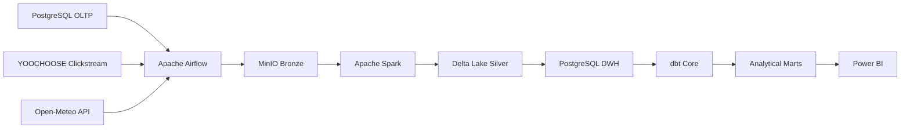

# FastOrder — Enterprise E-Commerce Data Platform

FastOrder is a **local-first, end-to-end Data Engineering platform** built to simulate the data infrastructure of a B2C e-commerce marketplace.

The project goes beyond a traditional `CSV → ETL → Dashboard` workflow.  
It models multiple real-world data ingestion patterns, a Medallion-style lake architecture, analytical warehouse modeling, orchestration, data quality, and BI consumption.

---

## Project Overview

FastOrder was designed around a simulated e-commerce business with:

- customers;
- products;
- sellers;
- orders and order items;
- payments and reviews;
- inventory;
- 5 warehouses;
- weather context;
- clickstream behavior.

The platform integrates three main data domains:

```text
Operational Commerce
Weather
Clickstream
```

Each domain has its own ingestion pattern, but all of them converge into a shared analytical warehouse.

---

## Architecture



### Current Technology Stack

| Layer | Technology |
|---|---|
| Operational Database | PostgreSQL 16 |
| Orchestration | Apache Airflow 3.3 |
| Executor | CeleryExecutor |
| Queue | Redis |
| Object Storage | MinIO |
| Bronze Serialization | PyArrow + Parquet |
| Processing | Apache Spark / PySpark 3.5.9 |
| Table Format | Delta Lake OSS |
| Analytical Warehouse | PostgreSQL 16 |
| Transformation | dbt Core |
| BI | Power BI Desktop |
| Runtime | Docker Compose |

---

## Data Domains

### 1. Operational Commerce

Operational data is seeded from Olist and loaded into the FastOrder PostgreSQL OLTP database.

FastOrder then performs incremental ingestion using:

```text
(updated_at, primary_key...)
```

as a composite watermark.

The operational pipeline covers 11 tables:

```text
customers
orders
order_items
order_payments
order_reviews
products
sellers
warehouses
inventory
geolocation
product_category_name_translation
```

End-to-end flow:

```text
PostgreSQL
    ↓
Airflow Incremental Ingestion
    ↓
MinIO Bronze
    ↓
Spark + Delta Silver
    ↓
PostgreSQL DWH
    ↓
dbt
    ↓
Fact / Dimension Marts
```

The ingestion framework supports:

- composite watermark extraction;
- upper watermark isolation;
- checkpoints;
- pending recovery;
- replay-safe execution;
- no-new-data `NO_OP`;
- deterministic ingestion identity.

---

### 2. Weather

Weather data is collected from Open-Meteo for five FastOrder warehouses.

Two flows are implemented:

```text
Forecast
Historical Forecast
```

Forecast is used for recurring ingestion.

Historical Forecast is used as a bootstrap/backfill workflow.

Weather Bronze preserves the original provider response:

```text
response.json
metadata.json
_SUCCESS
```

Current analytical marts:

```text
fact_weather_forecast_hourly
fact_weather_historical_forecast_hourly
```

---

### 3. Clickstream

FastOrder integrates the YOOCHOOSE clickstream dataset using a dedicated file-based ingestion framework.

Dataset scale:

```text
~33.0 million click events
183 event dates
~9.25 million sessions
```

File ingestion uses:

```text
File Discovery
      ↓
Manifest Manager
      ↓
Bronze Writer
```

Manifest states include:

```text
NEW
PENDING
PROCESSED
RETRY
```

Clickstream analytical models:

```text
int_clickstream_sessions
fact_clickstream_sessions
agg_clickstream_daily
```

FastOrder deliberately does **not** join YOOCHOOSE `item_id` with Olist/FastOrder `product_id`, because no valid shared business key exists between the datasets.

---

## Analytical Model

The analytical layer follows a dimensional model.

### Dimensions

```text
dim_date
dim_customers
dim_products
dim_sellers
dim_warehouses
```

### Commerce Facts

```text
fact_orders
fact_order_items
```

### Clickstream

```text
fact_clickstream_sessions
agg_clickstream_daily
```

### Weather

```text
fact_weather_forecast_hourly
fact_weather_historical_forecast_hourly
```

Relationships follow:

```text
Dimension 1 → * Fact
```

with single-direction filtering.

Fact-to-fact relationships are intentionally avoided.

---

## Data Scale

Current analytical data includes approximately:

| Dataset | Rows |
|---|---:|
| Orders | 99,492 |
| Order Items | 112,843 |
| Clickstream Events | 33,003,944 |
| Clickstream Sessions | 9,249,729 |
| Clickstream Daily Aggregates | 183 |
| Weather Forecast Hourly | 1,920 |
| Historical Weather Hourly | 12,240 |
| Warehouses | 5 |

---

## End-to-End Orchestration

Each domain has its own certified Airflow E2E DAG.

```text
Operational E2E ────────────┐
                            │
Weather Forecast E2E ───────┼──► Final Platform Validation
                            │
Clickstream E2E ────────────┘
```

The top-level DAG is:

```text
fastorder_platform_e2e
```

Historical weather is intentionally excluded from the normal recurring platform run because it is treated as a backfill/bootstrap workflow.

The master DAG ends with:

```text
dbt test
```

to validate the analytical layer after all participating domains finish.

---

## Airflow Operational Design

Operational E2E tasks are organized using TaskGroups.

Example:

```text
orders
├── ingest
├── bronze_to_silver
└── silver_to_dwh
```

Heavy Spark execution is isolated from normal Airflow Python execution.

A dedicated Airflow pool:

```text
spark_local
```

limits concurrent Spark workloads on the local development machine.

Master DAG triggers are configured as deferrable so Airflow workers are not occupied while waiting for child DAGs.

---

## Data Warehouse & dbt

The DWH contains three logical layers:

```text
staging
intermediate
marts
```

Examples of intermediate models:

```text
int_order_items_agg
int_order_payments_agg
int_orders_enriched
int_clickstream_sessions
```

dbt is responsible for:

- analytical SQL transformations;
- fact and dimension construction;
- business-grain validation;
- source tests;
- model tests;
- analytical marts.

Spark remains primarily responsible for:

```text
Bronze → Silver
```

while dbt owns relational analytical modeling.

---

## Power BI

Power BI connects to:

```text
PostgreSQL DWH
        ↓
marts
```

rather than directly querying operational or lake-layer data.

### FastOrder Executive Overview

The current BI v1 implements an Executive Overview containing:

- Total Revenue;
- Total Orders;
- Total Customers;
- Average Order Value;
- Items Sold;
- dynamic metric trends;
- customer-state analysis;
- order-status distribution;
- product-category performance;
- warehouse performance;
- top-product analysis.

> The Power BI `.pbix` file is intentionally not stored in normal Git history because of its file size. Dashboard screenshots are included instead.


Future BI pages may include:

```text
Product & Seller Performance
Customer & Geography
Digital Behavior
Weather & Operations Context
```

They are not part of the FastOrder v1 completion boundary.

---

## Warehouse Simulation

The original Olist dataset does not provide warehouse assignments compatible with the FastOrder business model.

Because Olist is treated as the seed of FastOrder's simulated backend, missing warehouse assignments are enriched deterministically.

Target distribution:

```text
WH_HCM ≈ 30%
WH_HN  ≈ 25%
WH_DN  ≈ 20%
WH_CT  ≈ 15%
WH_HP  ≈ 10%
```

The assignment is deterministic so the same order always maps to the same warehouse across reruns.

This is explicitly treated as **FastOrder synthetic operational data**, not original Olist truth.

---

## Reliability & Data Quality

The platform implements several reliability mechanisms:

### Ingestion

- composite watermark;
- upper-watermark isolation;
- checkpointing;
- pending recovery;
- deterministic identities;
- replay-safe reruns.

### Bronze

- source fidelity;
- explicit ingestion metadata;
- append-oriented storage.

### Silver

- schema normalization;
- deduplication;
- business-grain validation;
- data-quality checks.

### DWH

- temporary load staging;
- validation before target replacement;
- transactional finalization.

### dbt

- source tests;
- uniqueness tests;
- not-null tests;
- business-grain validation.

---

## Project Evolution

FastOrder did not start with its current architecture.

During August 2026, parts of the platform were successfully developed using:

```text
Azure Data Lake Storage Gen2
Azure Data Factory
Azure Databricks
Managed Identity
Unity Catalog
```

The project was later migrated to a fully local-first architecture:

```text
ADLS
    ↓
MinIO

Databricks
    ↓
Local Spark

Cloud-oriented analytics target
    ↓
PostgreSQL DWH
```

The migration preserved the core ingestion and transformation concepts while removing cloud billing and account dependencies.

Historical decisions are preserved in the project Decision Log.

---

## Repository Structure

```text
Enterprise-ECommerce-Data-Platform/
│
├── dags/
│   └── Airflow orchestration
│
├── fastorder/
│   ├── ingestion/
│   ├── transformation/
│   ├── loading/
│   ├── orchestration/
│   ├── storage/
│   └── db/
│
├── database/
│   └── PostgreSQL schema artifacts
│
├── dbt/
│   └── dbt models and tests
│
├── docker/
│   └── Local platform infrastructure
│
├── docs/
│   ├── 01-data-flows.md
│   ├── 02-business-analytics.md
│   ├── 03-technology-architecture.md
│   ├── 04-olap-schema.md
│   ├── 05-decision-log.md
│   └── 06-project-timeline.md
│
└── README.md
```

---

## Documentation

Detailed documentation is intentionally kept small and focused.

### Data Flow

[01 — Data Flows](docs/01-data-flows.md)

Explains how Operational, Weather and Clickstream data move through the platform.

### Business & Analytics

[02 — Business Analytics](docs/02-business-analytics.md)

Explains FastOrder's business context, stakeholders, analytical requirements and KPI boundaries.

### Technology Architecture

[03 — Technology Architecture](docs/03-technology-architecture.md)

Explains which technologies are used at each stage and how the current local-first architecture is structured.

### Analytical Schema

[04 — OLAP Schema](docs/04-olap-schema.md)

Describes Facts, Dimensions, grains and relationships.

### Decisions

[05 — Decision Log](docs/05-decision-log.md)

Records the major architectural decisions and superseded approaches.

### Timeline

[06 — Project Timeline](docs/06-project-timeline.md)

Documents the project's evolution from July 2026 through FastOrder v1.

---

## Key Engineering Lessons

FastOrder reinforced several Data Engineering principles:

```text
Business requirements before tools.

Bronze should preserve source fidelity.

Exactly-once should not be claimed without the architecture to guarantee it.

Replay safety is often more practical than pretending retries never happen.

Every Fact must have a clearly defined grain.

A relationship should exist because the business keys support it,
not because a dashboard needs another chart.

Spark and SQL/dbt solve different classes of transformations.

Orchestration should coordinate workloads, not contain all business logic.

A smaller reproducible architecture is often more valuable than
a larger architecture that cannot be maintained.
```

---

## Current Status

```text
Operational Pipeline       ✅ Complete
Weather Forecast Pipeline  ✅ Complete
Weather Historical Flow    ✅ Complete
Clickstream Pipeline       ✅ Complete
PostgreSQL DWH             ✅ Complete
dbt Analytical Layer       ✅ Complete
Platform E2E Orchestration ✅ Complete
Power BI Executive View    ✅ Complete
Documentation              ✅ Complete
```

FastOrder v1 is considered complete as an end-to-end Data Engineering portfolio project.

---

## Future Improvements

Potential future work includes:

- Kafka / event-streaming integration;
- real log-based CDC;
- CI/CD;
- automated data observability;
- cloud deployment;
- additional Power BI pages;
- inventory analytics;
- shared customer/product identities across behavioral and transaction systems;
- more realistic warehouse routing.

These items are intentionally outside the FastOrder v1 Definition of Done.

---

## Author

**Huỳnh Đăng Khoa**

Information Systems — University of Information Technology, VNU-HCM

Data Engineering Portfolio Project — 2026