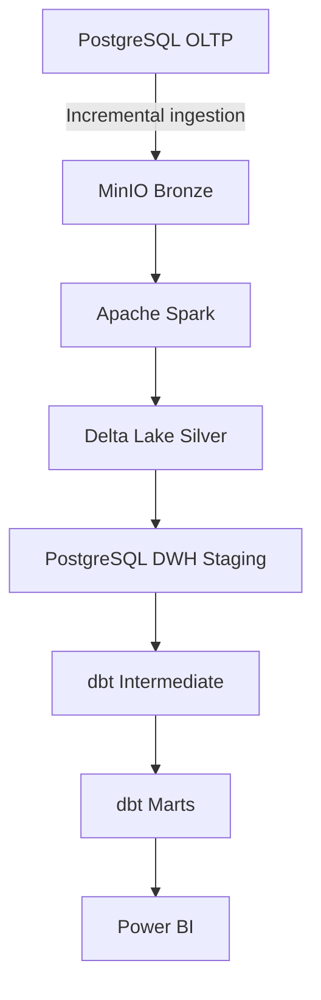
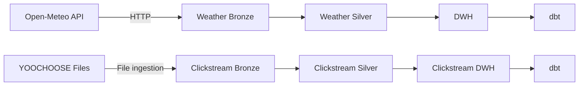
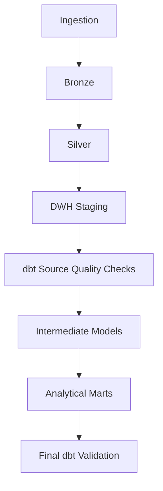

# FastOrder — Enterprise E-Commerce Data Platform

FastOrder is a local-first, end-to-end Data Engineering project that
simulates an e-commerce data platform processing operational, API,
and clickstream data.

The platform ingests data from PostgreSQL, Open-Meteo APIs, and
YOOCHOOSE files; stores raw and curated data in MinIO; transforms
large-scale datasets with Apache Spark and Delta Lake; loads analytical
data into PostgreSQL; models business-ready marts with dbt; and serves
analytics through Power BI.

<p align="center">
  
</p>

## Project at a Glance

| Area | Implementation |
|---|---|
| **Operational Data** | 11 PostgreSQL tables with incremental ingestion |
| **Clickstream Data** | ~33M events, ~9.2M sessions, 183 days |
| **External API** | Open-Meteo forecast and historical weather |
| **Data Lake** | MinIO Bronze + Delta Lake Silver |
| **Processing** | Apache Spark / PySpark |
| **Orchestration** | Apache Airflow 3 |
| **Data Warehouse** | PostgreSQL |
| **Transformation** | dbt Core |
| **Analytics** | Power BI |
| **Runtime** | Docker Compose, local-first and zero-cost |

## Business Context

FastOrder represents a B2C e-commerce marketplace operating across
five warehouses.

The platform supports analytics around:

- revenue and order performance;
- customer and product behavior;
- seller performance;
- warehouse operations;
- delivery performance;
- digital clickstream behavior;
- weather context around warehouse operations.

The objective is not only to move data between systems.

FastOrder is designed so data pipelines can be **replayed, validated,
recovered after failure, and consumed reliably by downstream
analytics**.

## End-to-End Data Flow



The business-ready Gold layer is implemented logically as
**dbt marts in PostgreSQL**, rather than as duplicated files in
the MinIO Gold bucket.

### Additional Ingestion Paths



## What Makes This Project Different

### 1. Reliable Incremental Ingestion

Operational ingestion is implemented for **11 tables** using a
composite cursor:

`(updated_at, primary_key...)`

The ingestion framework includes:

- fixed upper watermarks per run;
- checkpoint-based progress tracking;
- pending-batch recovery;
- deterministic Bronze identities;
- replay-safe processing;
- explicit schema validation.

This avoids reloading the entire operational database on every run
while still supporting safe retries and failure recovery.

### 2. Large-Scale Clickstream Processing

The YOOCHOOSE workload contains approximately:

- **33.0M clickstream events**
- **9.2M sessions**
- **183 days of activity**

Apache Spark and Delta Lake are used to process the event-level data.

Instead of copying all ~33M events into another analytical fact table,
FastOrder currently materializes:

- `fact_clickstream_sessions`
- `agg_clickstream_daily`

The current analytical use cases are session-oriented, so this avoids
duplicating a large event dataset without a clear downstream need.

Event-level data remains available in the Silver layer when deeper
analysis is required.

### 3. Failure Recovery and Replay Safety

Incremental ingestion separates:

- checkpoint state;
- pending-batch state;
- committed Bronze data.

A batch is not treated as successfully processed simply because its
source rows were extracted.

This design allows interrupted runs to recover without blindly
restarting the full ingestion process or creating duplicate Bronze
outputs.

### 4. End-to-End Orchestration

Apache Airflow orchestrates the complete platform:



The top-level platform workflow coordinates:

- operational data;
- weather forecast data;
- clickstream data;
- downstream dbt validation.

Historical weather ingestion is intentionally maintained as a
separate backfill workflow rather than part of the normal recurring
platform run.

<p align="center">
  
</p>

## Engineering Trade-offs

Technology choices in FastOrder are based on project requirements and
constraints rather than maximizing the number of tools in the stack.

### Local-First Instead of Cloud-First

**Decision:** Docker Compose + MinIO + PostgreSQL.

**Why**

- zero infrastructure cost;
- reproducible local environment;
- full control over services and storage;
- no dependency on paid cloud credits.

**Trade-off**

- does not demonstrate managed-cloud operations;
- compute and storage are limited by one development machine.

The logical architecture remains separated enough that local
components can later be replaced by equivalent managed services.

### PostgreSQL as the Analytical Warehouse

**Decision:** PostgreSQL is used as the current analytical warehouse.

**Why**

- sufficient for the current project scale;
- integrates cleanly with dbt and Power BI;
- already supports the required dimensional marts;
- avoids introducing an additional database without a clear need.

**Trade-off**

PostgreSQL is not a dedicated distributed OLAP engine and would not be
the final choice for every workload at substantially larger scale.

### Session-Level Clickstream Mart

**Decision:** Keep the atomic clickstream dataset in Silver and build
session-level and daily analytical marts in PostgreSQL.

**Why**

- downstream requirements are currently session-oriented;
- avoids duplicating ~33M event rows in another storage layer;
- lowers unnecessary warehouse storage and processing.

**Trade-off**

Event-level ad-hoc analysis uses the Silver dataset rather than the
current PostgreSQL marts.

### No Artificial Cross-Domain Join

YOOCHOOSE `item_id` and FastOrder/Olist `product_id` do not share a
trustworthy business key.

FastOrder therefore deliberately does **not** create a synthetic
relationship between them merely to produce a fully connected
analytical model.

Semantic correctness is preferred over forcing unrelated datasets
into the same star schema.

### Historical Weather as a Separate Backfill

**Decision:** historical weather ingestion is not part of the normal
recurring top-level platform workflow.

**Why**

Historical weather is primarily a bootstrap/backfill workload, while
forecast ingestion represents an ongoing operational workflow.

Keeping them separate prevents expensive historical reprocessing from
being triggered during normal platform runs.

## Data Warehouse and Analytical Layer

The warehouse is organized into three logical layers:

- `staging`
- `intermediate`
- `marts`

### Core Operational Marts

- `dim_customers`
- `dim_products`
- `dim_sellers`
- `dim_warehouses`
- `dim_date`
- `fact_orders`
- `fact_order_items`

### Clickstream Marts

- `fact_clickstream_sessions`
- `agg_clickstream_daily`

### Weather Marts

- `fact_weather_forecast_hourly`
- `fact_weather_historical_forecast_hourly`

The dimensional model is still being refined as the project evolves.
The repository documentation records modeling decisions and
limitations explicitly instead of hiding them behind the dashboard.

## Current Analytical Scale

| Model | Approximate Rows |
|---|---:|
| `fact_orders` | 99,492 |
| `fact_order_items` | 112,843 |
| `fact_clickstream_sessions` | 9,249,729 |
| `agg_clickstream_daily` | 183 |
| `fact_weather_forecast_hourly` | 1,920 |
| `fact_weather_historical_forecast_hourly` | 12,240 |

## Power BI Dashboard

The current Power BI scope focuses on an **Executive Overview** for
commercial and operational monitoring.

Key analytical areas include:

- revenue;
- orders;
- customers;
- average order value;
- delivery performance;
- cancellation rate;
- product activity;
- seller activity;
- warehouse performance.

<p align="center">
  
</p>

## Technology Stack

**Languages**

Python, SQL

**Orchestration**

Apache Airflow 3

**Distributed Processing**

Apache Spark, PySpark

**Data Lake / Lakehouse**

MinIO, Delta Lake

**Databases**

PostgreSQL

**Transformation and Modeling**

dbt Core, Dimensional Modeling, Data Quality Testing

**Analytics**

Power BI, DAX

**Infrastructure**

Docker, Docker Compose

## Airflow Workflows

FastOrder separates orchestration by domain instead of placing the
entire platform inside one large DAG.

### Operational Pipeline

<p align="center">
  
</p>

<p align="center">
  
</p>

### Clickstream Pipeline

<p align="center">
  
</p>

### Weather Forecast Pipeline

<p align="center">
  
</p>

### Historical Weather Backfill

<p align="center">
  
</p>

## Data Quality

Quality checks are applied at multiple stages instead of only at the
dashboard layer.

Examples include:

- source primary-key validation;
- business-grain uniqueness checks;
- required-column validation;
- row-count reconciliation;
- Bronze checkpoint reconciliation;
- pending-state cleanup validation;
- Silver-to-DWH validation;
- dbt `not_null` tests;
- dbt `unique` tests;
- dbt relationship tests;
- final platform-level dbt validation.

The goal is to detect data problems close to the layer where they are
introduced rather than allowing invalid data to silently propagate.

## Repository Structure

```text
.
├── assets/
├── dags/
├── database/
├── dbt/
│   └── models/
│       ├── intermediate/
│       ├── marts/
│       └── sources/
├── docker/
├── docs/
├── fastorder/
│   ├── db/
│   ├── ingestion/
│   ├── loading/
│   ├── orchestration/
│   ├── simulator/
│   ├── storage/
│   └── transformation/
└── scripts/
```

The Airflow DAG layer is intentionally kept thin.

Reusable ingestion, transformation, loading, storage, and runtime logic
lives inside the `fastorder/` package rather than being embedded
directly inside DAG definitions.

## Data Sources

### Operational Domain

The operational domain contains 11 incremental tables:

- `geolocation`
- `customers`
- `warehouses`
- `orders`
- `products`
- `sellers`
- `order_items`
- `order_reviews`
- `order_payments`
- `product_category_name_translation`
- `inventory`

### Weather

Weather data is obtained from Open-Meteo and includes:

- forecast ingestion;
- historical weather backfill.

### Clickstream

YOOCHOOSE provides high-volume behavioral event data used to build
session-level analytics.

Because YOOCHOOSE and the operational e-commerce dataset originate
from different domains, cross-domain product relationships are not
fabricated.

## Data Assumptions and Limitations

FastOrder combines public datasets with project-specific operational
extensions.

Some FastOrder-specific operational data is synthetic and is used to
support the platform scenario rather than represent original source
truth.

These assumptions are documented explicitly so analytical outputs are
not presented as facts that the underlying public datasets cannot
support.

The project prioritizes:

**correct semantics > visually convenient relationships**

and:

**traceable assumptions > fabricated business truth**

## Documentation

Detailed design and implementation notes are available in:

- [`01-data-flows.md`](docs/01-data-flows.md)
- [`02-business-analytics.md`](docs/02-business-analytics.md)
- [`03-technology-architecture.md`](docs/03-technology-architecture.md)
- [`04-olap-schema.md`](docs/04-olap-schema.md)
- [`05-decision-log.md`](docs/05-decision-log.md)
- [`06-project-timeline.md`](docs/06-project-timeline.md)

## Project Status

The main end-to-end platform has been implemented across:

**Operational DB → Bronze → Silver → DWH → dbt marts → Power BI**

with independent ingestion paths for operational, weather, and
clickstream data.

The next major modeling improvement is a deeper review of the
analytical warehouse schema, including dimensional modeling strategy,
conformed dimensions, key strategy, and documented modeling
trade-offs.