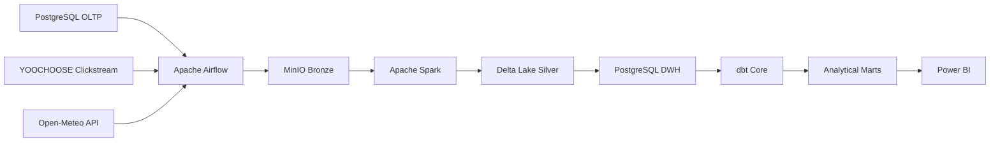
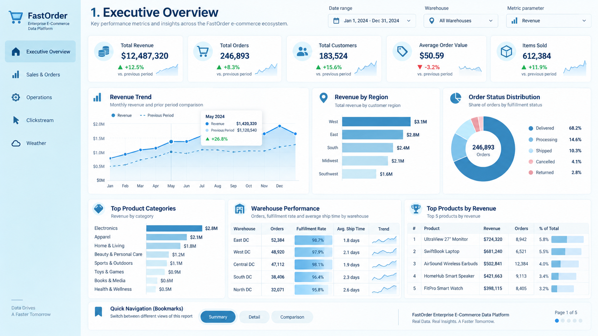

# FastOrder — Enterprise E-Commerce Data Platform

FastOrder là một **nền tảng Data Engineering end-to-end, local-first** được xây dựng để mô phỏng hạ tầng dữ liệu của một doanh nghiệp thương mại điện tử B2C.

Project không dừng ở mô hình đơn giản:

```text
CSV → ETL → Dashboard
```

mà mô phỏng nhiều vấn đề thực tế hơn của một data platform:

- nhiều loại source khác nhau;
- incremental ingestion;
- file-based ingestion;
- API ingestion;
- data lake;
- Spark transformation;
- Data Warehouse;
- dimensional modeling;
- orchestration;
- data quality;
- BI consumption.

---

## Tổng quan project

FastOrder được thiết kế như một marketplace thương mại điện tử giả lập gồm:

- khách hàng;
- sản phẩm;
- người bán;
- đơn hàng;
- chi tiết đơn hàng;
- thanh toán;
- đánh giá;
- tồn kho;
- 5 warehouse;
- dữ liệu thời tiết;
- dữ liệu hành vi clickstream.

Platform hiện tích hợp ba data domain chính:

```text
Operational Commerce
Weather
Clickstream
```

Mỗi domain có cách ingestion khác nhau nhưng cuối cùng cùng hội tụ về một analytical warehouse chung.

---

## Kiến trúc tổng quát



### Technology Stack hiện tại

| Giai đoạn | Công nghệ |
|---|---|
| Operational Database | PostgreSQL 16 |
| Orchestration | Apache Airflow 3.3 |
| Executor | CeleryExecutor |
| Message Broker | Redis |
| Object Storage | MinIO |
| Bronze Serialization | PyArrow + Parquet |
| Data Processing | Apache Spark / PySpark 3.5.9 |
| Table Format | Delta Lake OSS |
| Analytical Warehouse | PostgreSQL 16 |
| Transformation | dbt Core |
| BI | Power BI Desktop |
| Local Runtime | Docker Compose |

---

## Các data domain

### 1. Operational Commerce

Dữ liệu Olist được sử dụng như seed data để khởi tạo FastOrder PostgreSQL OLTP.

Sau khi bootstrap, PostgreSQL trở thành source operational chính.

FastOrder thực hiện incremental ingestion dựa trên composite watermark:

```text
(updated_at, primary_key...)
```

Operational domain hiện gồm 11 bảng:

```text
customers
orders
order_items
order_payments
order_reviews
products
sellers
warehouses
inventory
geolocation
product_category_name_translation
```

Luồng end-to-end:

```text
PostgreSQL OLTP
        ↓
Airflow Incremental Ingestion
        ↓
MinIO Bronze
        ↓
Spark + Delta Lake Silver
        ↓
PostgreSQL DWH
        ↓
dbt
        ↓
Fact / Dimension Marts
```

Incremental ingestion framework hỗ trợ:

- composite watermark;
- upper watermark;
- checkpoint;
- pending recovery;
- replay-safe rerun;
- no-new-data `NO_OP`;
- deterministic ingestion identity.

---

### 2. Weather

FastOrder thu thập dữ liệu thời tiết từ Open-Meteo cho 5 warehouse.

Hai luồng được triển khai:

```text
Forecast
Historical Forecast
```

Forecast được sử dụng cho ingestion định kỳ.

Historical Forecast được sử dụng cho bootstrap/backfill.

Weather Bronze giữ nguyên provider response theo cấu trúc:

```text
response.json
metadata.json
_SUCCESS
```

Các analytical marts hiện tại:

```text
fact_weather_forecast_hourly
fact_weather_historical_forecast_hourly
```

---

### 3. Clickstream

FastOrder tích hợp bộ dữ liệu YOOCHOOSE để mô phỏng hành vi người dùng.

Quy mô dữ liệu:

```text
~33.0 triệu click events
183 ngày dữ liệu
~9.25 triệu sessions
```

Clickstream sử dụng một file-based ingestion framework riêng:

```text
File Discovery
      ↓
Manifest Manager
      ↓
Bronze Writer
```

Các trạng thái manifest:

```text
NEW
PENDING
PROCESSED
RETRY
```

Các analytical models chính:

```text
int_clickstream_sessions
fact_clickstream_sessions
agg_clickstream_daily
```

FastOrder chủ động **không join**:

```text
YOOCHOOSE item_id
```

với:

```text
FastOrder / Olist product_id
```

vì không có shared business key hợp lệ giữa hai dataset.

---

## Analytical Model

Analytical layer được thiết kế theo dimensional model.

### Dimensions

```text
dim_date
dim_customers
dim_products
dim_sellers
dim_warehouses
```

### Commerce Facts

```text
fact_orders
fact_order_items
```

### Clickstream

```text
fact_clickstream_sessions
agg_clickstream_daily
```

### Weather

```text
fact_weather_forecast_hourly
fact_weather_historical_forecast_hourly
```

Relationship tuân theo:

```text
Dimension 1 → * Fact
```

và sử dụng single-direction filtering.

Fact-to-fact relationship được tránh để giảm ambiguity và giữ đúng grain semantics.

---

## Quy mô dữ liệu hiện tại

| Dataset | Số dòng |
|---|---:|
| Orders | 99,492 |
| Order Items | 112,843 |
| Clickstream Events | 33,003,944 |
| Clickstream Sessions | 9,249,729 |
| Clickstream Daily Aggregates | 183 |
| Weather Forecast Hourly | 1,920 |
| Historical Weather Hourly | 12,240 |
| Warehouses | 5 |

---

## End-to-End Orchestration

Mỗi domain có một Airflow E2E DAG riêng.

```text
Operational E2E ────────────┐
                            │
Weather Forecast E2E ───────┼──► Final Platform Validation
                            │
Clickstream E2E ────────────┘
```

Top-level DAG:

```text
fastorder_platform_e2e
```

Historical weather được giữ ngoài normal recurring platform run vì được xem là bootstrap/backfill workflow.

Sau khi các domain hoàn thành, master DAG chạy:

```text
dbt test
```

để xác nhận analytical layer vẫn hợp lệ trên toàn platform.

---

## Airflow Operational Design

Operational E2E được tổ chức bằng TaskGroup theo từng entity.

Ví dụ:

```text
orders
├── ingest
├── bronze_to_silver
└── silver_to_dwh
```

Heavy Spark workload không chạy trực tiếp trong Airflow Python process.

Airflow worker sử dụng Docker execution boundary để gọi Spark runtime riêng.

FastOrder cũng sử dụng Airflow pool:

```text
spark_local
```

với:

```text
1 slot
```

để tránh nhiều Spark job nặng chạy đồng thời trên môi trường local.

Master DAG sử dụng deferrable triggers để không giữ worker slot trong lúc chờ child DAG hoàn thành.

---

## Data Warehouse và dbt

PostgreSQL DWH gồm ba logical layer:

```text
staging
intermediate
marts
```

Một số intermediate models:

```text
int_order_items_agg
int_order_payments_agg
int_orders_enriched
int_clickstream_sessions
```

dbt chịu trách nhiệm:

- analytical SQL transformation;
- Fact / Dimension modeling;
- business-grain validation;
- source tests;
- model tests;
- analytical marts.

Spark chủ yếu chịu trách nhiệm:

```text
Bronze → Silver
```

Trong khi dbt chịu trách nhiệm cho relational analytical modeling.

---

## Power BI

Power BI kết nối trực tiếp tới:

```text
PostgreSQL DWH
        ↓
marts
```

thay vì đọc trực tiếp từ:

```text
OLTP
Bronze
Silver
```

### Executive Overview

Power BI v1 hiện có một Executive Overview tập trung vào:

- Total Revenue;
- Total Orders;
- Total Customers;
- Average Order Value;
- Items Sold;
- Dynamic Metric Trend;
- Customer State Analysis;
- Order Status Distribution;
- Product Category Performance;
- Top Products;
- Warehouse Performance.

> File `.pbix` không được lưu trực tiếp trong Git history thông thường vì kích thước lớn. Repo chỉ lưu hình ảnh dashboard để minh họa kết quả cuối cùng.



Các dashboard page dự kiến trong tương lai:

```text
Product & Seller Performance
Customer & Geography
Digital Behavior
Weather & Operations Context
```

Các page này không nằm trong phạm vi hoàn thành của FastOrder v1.

---

## Warehouse Simulation

Olist gốc không cung cấp warehouse assignment phù hợp với FastOrder business model.

Do Olist được xem như seed data của backend FastOrder giả lập, các order thiếu warehouse được enrich bằng deterministic assignment.

Phân bố mục tiêu:

```text
WH_HCM ≈ 30%
WH_HN  ≈ 25%
WH_DN  ≈ 20%
WH_CT  ≈ 15%
WH_HP  ≈ 10%
```

Cùng một order luôn được map về cùng một warehouse giữa các lần chạy lại.

Warehouse assignment này là:

```text
FastOrder synthetic operational data
```

không phải dữ liệu gốc được quan sát từ Olist.

---

## Reliability và Data Quality

Platform triển khai nhiều cơ chế để tăng độ tin cậy.

### Ingestion Layer

- composite watermark;
- upper watermark isolation;
- checkpoint;
- pending recovery;
- deterministic identity;
- replay-safe rerun.

### Bronze Layer

- giữ source fidelity;
- technical ingestion metadata;
- append-oriented storage.

### Silver Layer

- schema normalization;
- deduplication;
- business-grain validation;
- data-quality checks.

### DWH Layer

- temporary load table;
- validation trước khi thay đổi target;
- transactional finalization.

### dbt Layer

- source tests;
- uniqueness tests;
- not-null tests;
- business-grain tests.

---

## Quá trình phát triển kiến trúc

FastOrder không bắt đầu trực tiếp với kiến trúc local hiện tại.

Trong tháng 8/2026, một phần platform từng được triển khai trên Azure với:

```text
Azure Data Lake Storage Gen2
Azure Data Factory
Azure Databricks
Managed Identity
Unity Catalog
```

Sau đó project được chuyển sang local-first architecture:

```text
ADLS
    ↓
MinIO

Databricks
    ↓
Local Spark

Cloud-oriented analytical target
    ↓
PostgreSQL DWH
```

Việc migration giữ lại các nguyên tắc ingestion và transformation đã được thiết kế trước đó, nhưng loại bỏ cloud billing và account dependency.

Các quyết định lịch sử vẫn được giữ trong Decision Log.

---

## Cấu trúc repository

```text
Enterprise-ECommerce-Data-Platform/
│
├── dags/
│   └── Airflow orchestration
│
├── fastorder/
│   ├── ingestion/
│   ├── transformation/
│   ├── loading/
│   ├── orchestration/
│   ├── storage/
│   └── db/
│
├── database/
│   └── PostgreSQL schema artifacts
│
├── dbt/
│   └── dbt models và tests
│
├── docker/
│   └── local platform infrastructure
│
├── docs/
│   ├── 01-data-flows.md
│   ├── 02-business-analytics.md
│   ├── 03-technology-architecture.md
│   ├── 04-olap-schema.md
│   ├── 05-decision-log.md
│   └── 06-project-timeline.md
│
└── README.md
```

---

## Tài liệu chi tiết

Bộ tài liệu được giữ nhỏ và mỗi file có một trách nhiệm rõ ràng.

### Data Flow

[01 — Data Flows](docs/01-data-flows.md)

Mô tả cách dữ liệu Operational, Weather và Clickstream di chuyển xuyên suốt platform.

### Business & Analytics

[02 — Business Analytics](docs/02-business-analytics.md)

Mô tả business context, stakeholders, analytical requirements và KPI boundaries.

### Technology Architecture

[03 — Technology Architecture](docs/03-technology-architecture.md)

Mô tả công nghệ được sử dụng tại từng layer và current local-first architecture.

### Analytical Schema

[04 — OLAP Schema](docs/04-olap-schema.md)

Mô tả Fact, Dimension, grain và relationships.

### Decision Log

[05 — Decision Log](docs/05-decision-log.md)

Lưu các quyết định kiến trúc quan trọng và các phương án đã bị superseded.

### Project Timeline

[06 — Project Timeline](docs/06-project-timeline.md)

Lưu quá trình phát triển FastOrder từ cuối tháng 7/2026 đến FastOrder v1.

---

## Một số nguyên tắc Data Engineering rút ra từ project

FastOrder được xây dựng dựa trên các nguyên tắc:

```text
Business requirement đi trước technology.

Bronze phải giữ source fidelity.

Không tuyên bố Exactly-Once nếu kiến trúc không thực sự đảm bảo điều đó.

Replay-safe thường thực tế hơn việc giả định retry sẽ không xảy ra.

Mỗi Fact phải có business grain rõ ràng.

Relationship chỉ tồn tại khi có business key hợp lệ.

Không ép relationship chỉ để tạo thêm dashboard.

Spark và dbt giải quyết các nhóm bài toán khác nhau.

Airflow chịu trách nhiệm orchestration,
không phải toàn bộ business logic.

Một architecture nhỏ nhưng reproducible
có giá trị hơn một architecture lớn nhưng khó duy trì.
```

---

## Trạng thái hiện tại

```text
Operational Pipeline       ✅ Hoàn thành
Weather Forecast Pipeline  ✅ Hoàn thành
Weather Historical Flow    ✅ Hoàn thành
Clickstream Pipeline       ✅ Hoàn thành
PostgreSQL DWH             ✅ Hoàn thành
dbt Analytical Layer       ✅ Hoàn thành
Platform E2E Orchestration ✅ Hoàn thành
Power BI Executive View    ✅ Hoàn thành
Documentation              ✅ Hoàn thành
```

FastOrder v1 được xem là hoàn thành ở mức một **end-to-end Data Engineering portfolio project**.

---

## Hướng phát triển tiếp theo

Một số hướng có thể tiếp tục trong tương lai:

- Kafka / Event Streaming;
- log-based CDC;
- CI/CD;
- automated data observability;
- cloud deployment;
- thêm Power BI pages;
- inventory analytics;
- shared identity giữa clickstream và transactional systems;
- warehouse routing thực tế hơn.

Các hạng mục này không nằm trong Definition of Done của FastOrder v1.

---

## Tác giả

**Huỳnh Đăng Khoa**

Sinh viên ngành Hệ thống Thông tin  
Trường Đại học Công nghệ Thông tin — ĐHQG TP.HCM

**Data Engineering Portfolio Project — 2026**