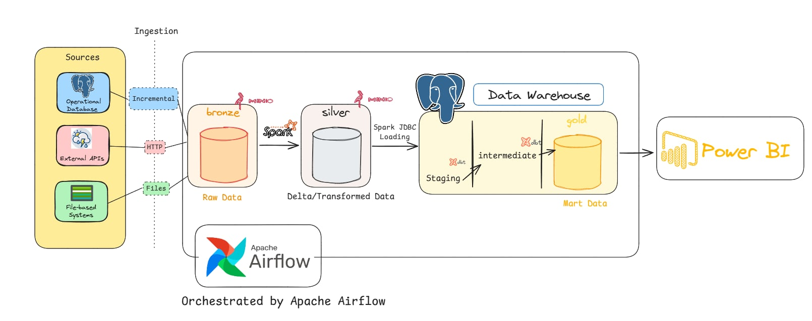
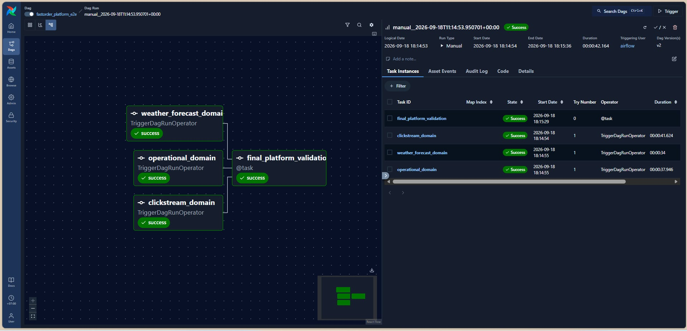
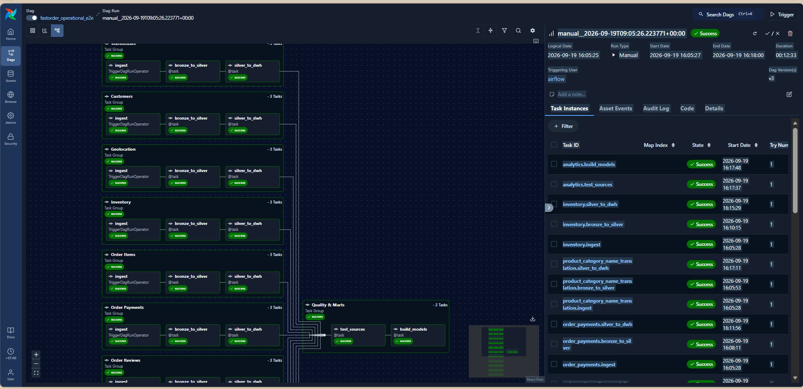
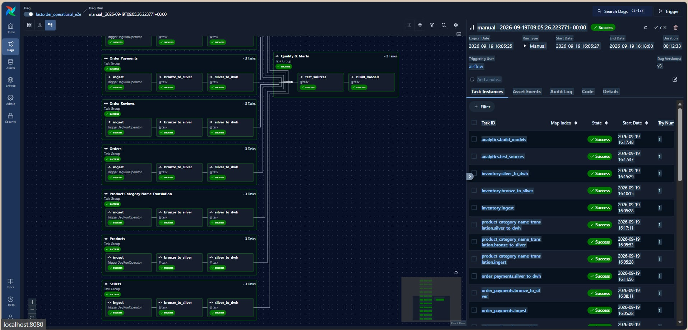
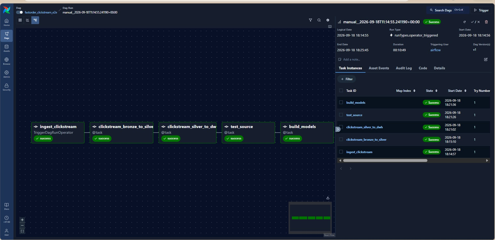
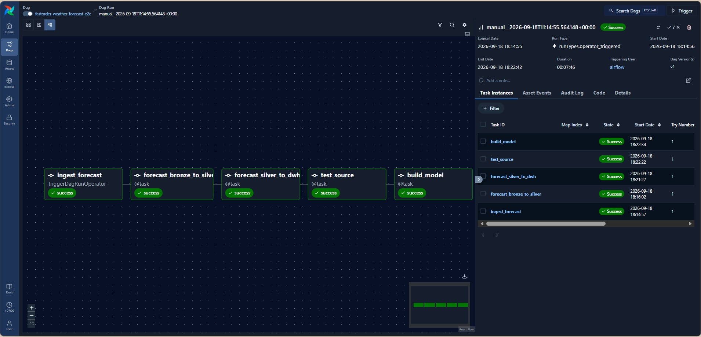
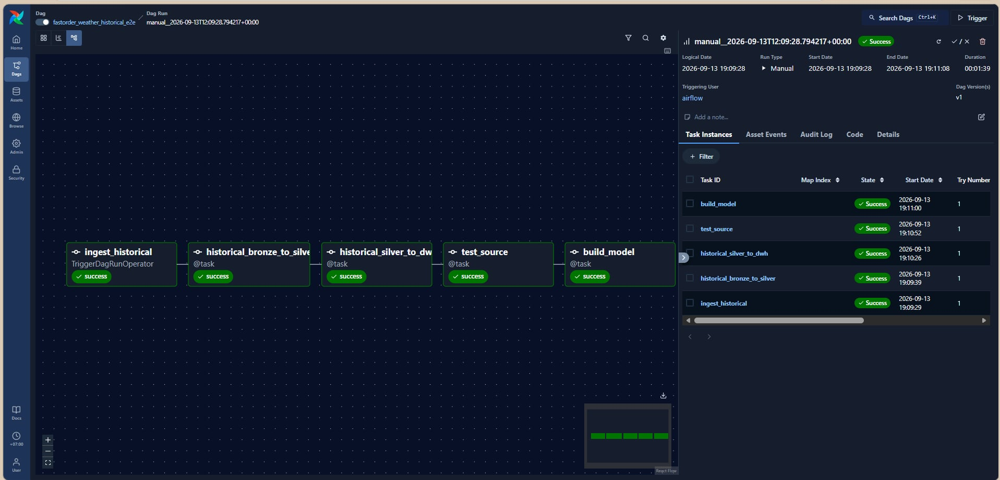
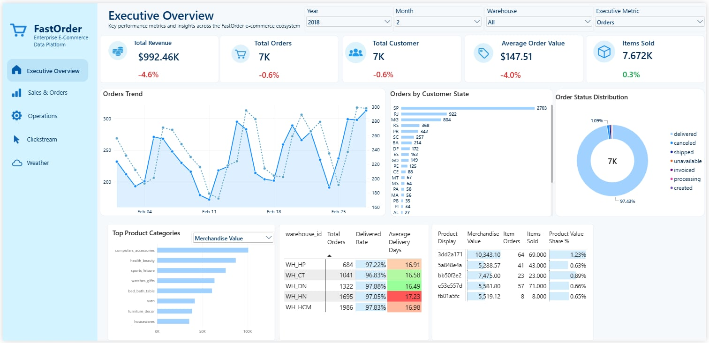

# FastOrder — Enterprise E-Commerce Data Platform

FastOrder là một **nền tảng Data Engineering end-to-end, local-first** được xây dựng để mô phỏng hạ tầng dữ liệu của một doanh nghiệp thương mại điện tử B2C.

Project không dừng lại ở mô hình:

```text
CSV → ETL → Dashboard
```

mà tập trung mô phỏng nhiều bài toán thực tế hơn của một data platform:

- operational database có dữ liệu thay đổi;
- incremental ingestion;
- file-based ingestion;
- API ingestion;
- replay và crash recovery;
- object-storage Data Lake;
- Spark transformation;
- Delta Lake;
- Data Warehouse;
- dimensional modeling;
- workflow orchestration;
- data quality;
- Business Intelligence.

---

# 1. Tổng quan

FastOrder được thiết kế như một marketplace thương mại điện tử giả lập với các thành phần:

- khách hàng;
- sản phẩm;
- người bán;
- đơn hàng;
- chi tiết đơn hàng;
- thanh toán;
- đánh giá;
- tồn kho;
- 5 warehouse;
- dữ liệu thời tiết;
- dữ liệu hành vi clickstream.

Platform hiện tích hợp ba data domain chính:

```text
Operational Commerce
Weather
Clickstream
```

Mỗi domain có ingestion pattern riêng nhưng cuối cùng cùng hội tụ về một analytical warehouse chung.

---

# 2. Kiến trúc tổng quát



FastOrder v1 sử dụng kiến trúc:

```text
Sources
   ↓
Ingestion
   ↓
Bronze
   ↓
Silver
   ↓
Data Warehouse
   ↓
Gold / Data Marts
   ↓
Power BI
```

Ba loại source chính:

```text
Operational Database
        ↓
Incremental Extraction

External API
        ↓
HTTP Ingestion

File-based Source
        ↓
File Ingestion
```

sau đó hội tụ về cùng data platform.

Luồng công nghệ chính:

```text
PostgreSQL OLTP
YOOCHOOSE
Open-Meteo
        ↓
Apache Airflow
        ↓
MinIO Bronze
        ↓
Apache Spark
        ↓
MinIO + Delta Lake Silver
        ↓
PostgreSQL Data Warehouse
        ↓
dbt
        ↓
Marts / Gold
        ↓
Power BI
```

> Bronze và Silver được materialize trên MinIO.  
> Gold là logical analytical layer được materialize trong PostgreSQL DWH thông qua các dbt marts.

---

# 3. Technology Stack

| Layer / Responsibility | Technology |
|---|---|
| Operational Database | PostgreSQL 16 |
| External API | Open-Meteo |
| File Source | YOOCHOOSE |
| Workflow Orchestration | Apache Airflow 3.3 |
| Airflow Executor | CeleryExecutor |
| Message Broker | Redis |
| Airflow Metadata Database | PostgreSQL |
| Object Storage | MinIO |
| Bronze Serialization | PyArrow + Parquet |
| Processing Engine | Apache Spark / PySpark 3.5.9 |
| Silver Table Format | Delta Lake OSS |
| Analytical Warehouse | PostgreSQL 16 |
| Analytical Modeling | dbt Core |
| dbt Adapter | dbt-postgres |
| Business Intelligence | Power BI Desktop |
| Runtime | Docker Compose |

---

# 4. Data Domains

## 4.1. Operational Commerce

Olist được sử dụng làm seed data để khởi tạo FastOrder Operational Database.

Sau bootstrap:

```text
Olist
   ↓
PostgreSQL FastOrder
```

PostgreSQL trở thành source operational chính.

Operational domain gồm 11 bảng:

```text
geolocation
customers
warehouses
orders
products
sellers
order_items
order_reviews
order_payments
product_category_name_translation
inventory
```

Luồng end-to-end:

```text
PostgreSQL OLTP
        ↓
Airflow Incremental Ingestion
        ↓
MinIO Bronze
        ↓
Spark + Delta Lake Silver
        ↓
PostgreSQL DWH
        ↓
dbt
        ↓
Fact / Dimension Marts
```

---

## 4.2. Incremental Ingestion

FastOrder không sử dụng log-based CDC trong phiên bản hiện tại.

Operational ingestion sử dụng:

```text
timestamp-based incremental extraction
```

với composite watermark:

```text
(updated_at, primary_key...)
```

Ví dụ:

```text
orders
(updated_at, order_id)
```

Cơ chế này giải quyết trường hợp nhiều records có cùng `updated_at`.

Framework hỗ trợ:

- lower watermark;
- upper watermark;
- batching;
- checkpoint;
- pending recovery;
- replay-safe rerun;
- no-new-data `NO_OP`;
- deterministic processing state.

---

## 4.3. Weather

Weather data được lấy từ Open-Meteo cho 5 warehouse của FastOrder.

Hai pipeline được triển khai:

```text
Forecast
Historical Forecast
```

### Forecast

Được sử dụng cho recurring operational ingestion.

```text
Open-Meteo
    ↓
Airflow
    ↓
Bronze Snapshot
    ↓
Spark
    ↓
Delta Silver
    ↓
PostgreSQL DWH
    ↓
dbt
```

### Historical Forecast

Được sử dụng cho:

```text
bootstrap / backfill
```

và được chạy độc lập với recurring master platform flow.

Weather Bronze sử dụng Sidecar Pattern:

```text
response.json
metadata.json
_SUCCESS
```

Trong đó:

- `response.json`: raw provider response;
- `metadata.json`: FastOrder technical metadata;
- `_SUCCESS`: ingestion commit marker.

---

## 4.4. Clickstream

FastOrder sử dụng YOOCHOOSE để mô phỏng behavioral data.

Quy mô source:

```text
33,003,944 click events
183 event dates
```

Clickstream sử dụng file-based ingestion thay vì database watermark.

Luồng:

```text
Prepared Files
      ↓
File Discovery
      ↓
Manifest Manager
      ↓
Bronze
      ↓
Spark / Delta Silver
      ↓
PostgreSQL DWH
      ↓
dbt Sessionization
```

Manifest hỗ trợ các trạng thái:

```text
NEW
PENDING
PROCESSED
RETRY
```

Sau sessionization:

```text
~9.25 million sessions
```

được tạo từ khoảng 33 triệu events.

---

# 5. Không tạo Fake Cross-Domain Join

YOOCHOOSE và Olist/FastOrder không có shared business key được chứng minh.

Đặc biệt:

```text
YOOCHOOSE item_id
≠
FastOrder product_id
```

Do đó FastOrder không tạo các relationship giả như:

```text
Clickstream → Products
Clickstream → Orders
Clickstream → Customers
```

và không tuyên bố các KPI như:

```text
click-to-purchase conversion
session-to-order conversion
```

khi lineage không hỗ trợ.

Nguyên tắc của project là:

> Analytical correctness quan trọng hơn việc tạo thêm một dashboard đẹp nhưng không có business key hợp lệ.

---

# 6. Bronze và Silver

## Bronze

Bronze được lưu trên MinIO.

Operational Bronze chủ yếu sử dụng:

```text
Parquet
```

Bronze tập trung vào:

- source fidelity;
- ingestion metadata;
- replay safety;
- hạn chế business transformation.

---

## Silver

Silver sử dụng:

```text
Apache Spark
+
Delta Lake OSS
+
MinIO
```

Silver chịu trách nhiệm:

- schema normalization;
- type normalization;
- deduplication;
- data-quality validation;
- canonical representation;
- business-grain enforcement.

Luồng:

```text
Bronze
   ↓
Apache Spark
   ↓
Transformation
   ↓
Delta Lake Silver
```

---

# 7. PostgreSQL Data Warehouse

Silver được load vào PostgreSQL DWH thông qua Spark JDBC.

Luồng:

```text
Silver
   ↓
Spark JDBC Loading
   ↓
PostgreSQL DWH
```

DWH gồm ba logical layer:

```text
staging
   ↓
intermediate
   ↓
marts
```

Trong đó:

```text
marts
=
Gold analytical layer
```

---

## 7.1. Staging

Staging nhận dữ liệu đã được chuẩn hóa từ Silver.

Vai trò:

- warehouse loading boundary;
- source cho dbt;
- giữ dữ liệu gần Silver trước business modeling.

---

## 7.2. Intermediate

dbt intermediate models thực hiện các transformation phục vụ analytical modeling.

Một số models:

```text
int_order_items_agg
int_order_payments_agg
int_orders_enriched
int_clickstream_sessions
```

---

## 7.3. Marts / Gold

Marts là business-ready analytical layer.

Các marts hiện tại gồm:

### Dimensions

```text
dim_date
dim_customers
dim_products
dim_sellers
dim_warehouses
```

### Commerce Facts

```text
fact_orders
fact_order_items
```

### Clickstream

```text
fact_clickstream_sessions
agg_clickstream_daily
```

### Weather

```text
fact_weather_forecast_hourly
fact_weather_historical_forecast_hourly
```

---

# 8. Analytical Model

FastOrder sử dụng dimensional modeling.

Relationship mặc định:

```text
Dimension
    1
    │
    *
   Fact
```

với:

```text
Single-direction filtering
Dimension → Fact
```

Fact-to-fact relationship được tránh.

Ví dụ:

```text
Dim Customers
      ↓
Fact Orders

Dim Customers
      ↓
Fact Order Items

Dim Products
      ↓
Fact Order Items

Dim Sellers
      ↓
Fact Order Items

Dim Warehouses
      ↓
Fact Orders
      ↓
Fact Order Items
```

Hai conformed dimensions quan trọng xuyên domain:

```text
Dim Date
Dim Warehouses
```

---

# 9. Business Grain

Mỗi Fact có grain rõ ràng.

| Model | Grain |
|---|---|
| `fact_orders` | 1 row / order |
| `fact_order_items` | 1 row / order item |
| `fact_clickstream_sessions` | 1 row / session |
| `agg_clickstream_daily` | 1 row / event date |
| `fact_weather_forecast_hourly` | warehouse × ingestion snapshot × forecast hour |
| `fact_weather_historical_forecast_hourly` | warehouse × weather hour |

FastOrder không sử dụng measure của Fact này cho Dimension chỉ filter được Fact khác nếu model không hỗ trợ semantics đó.

---

# 10. Quy mô dữ liệu

Quy mô analytical data hiện tại:

| Dataset | Số dòng |
|---|---:|
| Orders | 99,492 |
| Order Items | 112,843 |
| Clickstream Events | 33,003,944 |
| Clickstream Sessions | 9,249,729 |
| Clickstream Daily Aggregates | 183 |
| Weather Forecast Hourly | 1,920 |
| Historical Weather Hourly | 12,240 |
| Warehouses | 5 |

Clickstream là workload lớn nhất của platform.

---

# 11. End-to-End Orchestration

Mỗi data domain được productionize thành một E2E DAG độc lập trước khi được đưa vào master orchestration.

```text
Operational E2E ────────────┐
                            │
Weather Forecast E2E ───────┼──► Final Platform Validation
                            │
Clickstream E2E ────────────┘
```

Top-level DAG:

```text
fastorder_platform_e2e
```

Historical Weather không nằm trong recurring master DAG vì đây là bootstrap/backfill workflow.

Master DAG kết thúc bằng:

```text
dbt test
```

để thực hiện final cross-domain analytical validation.

## Master Platform DAG



Master DAG sử dụng deferrable DAG triggers để Airflow worker không phải giữ worker slot trong lúc chờ child DAG hoàn thành.

---

# 12. Operational E2E

Operational domain được chia thành TaskGroup theo từng entity.

Mỗi TaskGroup có lifecycle:

```text
ingest
    ↓
bronze_to_silver
    ↓
silver_to_dwh
```

Ví dụ:

```text
orders
├── ingest
├── bronze_to_silver
└── silver_to_dwh
```

Sau khi các operational entities hoàn thành:

```text
analytics
├── test_sources
└── build_models
```

được thực thi.

## Operational TaskGroups





TaskGroup giúp:

- Airflow Graph dễ đọc hơn;
- quan sát trạng thái từng entity;
- debug từng pipeline dễ hơn;
- giảm độ phức tạp của operational DAG.

---

# 13. Domain E2E Pipelines

Ngoài Operational Commerce, Weather và Clickstream cũng được productionize thành các E2E workflow độc lập.

## Clickstream E2E

```text
YOOCHOOSE
    ↓
File Discovery
    ↓
Manifest
    ↓
Bronze
    ↓
Spark / Delta Silver
    ↓
PostgreSQL DWH
    ↓
dbt Sessionization
```

<details>

<summary><strong>Xem Airflow Clickstream E2E Graph</strong></summary>

<br>



</details>

---

## Weather Forecast E2E

```text
Open-Meteo
    ↓
Bronze Snapshot
    ↓
Spark / Delta Silver
    ↓
PostgreSQL DWH
    ↓
dbt Weather Mart
```

<details>

<summary><strong>Xem Airflow Weather Forecast E2E Graph</strong></summary>

<br>



</details>

---

## Historical Weather E2E

Historical Weather được thiết kế như một independent bootstrap/backfill workflow.

<details>

<summary><strong>Xem Airflow Historical Weather E2E Graph</strong></summary>

<br>



</details>

---

# 14. Airflow Runtime

FastOrder sử dụng:

```text
Apache Airflow 3.3
CeleryExecutor
```

Các components chính:

```text
API Server
Scheduler
DAG Processor
Triggerer
Worker
Redis
PostgreSQL Metadata
```

Reusable runtime logic được đặt trong:

```text
fastorder/
```

DAG files chủ yếu chịu trách nhiệm:

```text
orchestration
```

thay vì chứa toàn bộ business logic.

---

# 15. Spark Execution

Heavy Spark workload được chạy trong Spark runtime riêng.

Airflow worker sử dụng Docker execution boundary để trigger workload.

Nguyên tắc:

```text
Airflow
=
Orchestrator

Spark
=
Processing Engine
```

FastOrder sử dụng Airflow pool:

```text
spark_local
```

với:

```text
1 slot
```

để tránh nhiều Spark jobs nặng chạy đồng thời trên môi trường local.

---

# 16. dbt

dbt chịu trách nhiệm analytical SQL modeling.

Luồng:

```text
DWH staging
      ↓
dbt sources
      ↓
intermediate
      ↓
Fact / Dimension Marts
      ↓
dbt tests
```

Spark chủ yếu chịu trách nhiệm:

```text
Bronze → Silver
```

Trong khi dbt chịu trách nhiệm:

```text
Warehouse → Analytical Model
```

Hai công nghệ được sử dụng cho hai loại transformation khác nhau.

---

# 17. Power BI

Power BI là consumption layer cuối cùng.

Power BI kết nối:

```text
PostgreSQL DWH
        ↓
marts
```

thay vì đọc trực tiếp từ:

```text
OLTP
Bronze
Silver
```

## Executive Overview

Power BI v1 tập trung vào một Executive Overview.

Các KPI chính:

```text
Total Revenue
Total Orders
Total Customers
Average Order Value
Items Sold
```

Các phân tích hiện có:

- KPI comparison với previous period;
- Dynamic Metric Trend;
- Customer State Analysis;
- Order Status Distribution;
- Product Category Performance;
- Top Products;
- Warehouse Performance.



File `.pbix` không được lưu trong normal Git history do kích thước lớn.

Repository giữ screenshot của dashboard làm portfolio artifact.

Các dashboard có thể phát triển thêm:

```text
Product & Seller Performance
Customer & Geography
Digital Behavior
Weather & Operations Context
```

nhưng không nằm trong Definition of Done của FastOrder v1.

---

# 18. Warehouse Simulation

Olist không có warehouse assignment phù hợp với FastOrder business model.

Do Olist được xem là seed data của FastOrder backend giả lập, các orders thiếu warehouse được enrich bằng deterministic assignment.

Phân bố mục tiêu:

```text
WH_HCM ≈ 30%
WH_HN  ≈ 25%
WH_DN  ≈ 20%
WH_CT  ≈ 15%
WH_HP  ≈ 10%
```

Assignment được thiết kế deterministic để cùng một `order_id` luôn được map về cùng warehouse.

Order items được đồng bộ warehouse theo parent order.

Đây là:

```text
FastOrder synthetic operational data
```

không phải warehouse information từ Olist gốc.

---

# 19. Reliability

FastOrder triển khai nhiều cơ chế nhằm tăng khả năng recover và rerun pipeline.

## Ingestion

```text
Composite Watermark
Upper Watermark
Checkpoint
Pending Recovery
Deterministic Identity
Replay-safe Rerun
```

---

## Bronze

```text
Source Fidelity
Technical Metadata
Replay Safety
```

---

## Silver

```text
Schema Validation
Deduplication
Data Quality
Business Grain Validation
```

---

## DWH

```text
Temporary Load Table
Validation
Transactional Finalization
```

---

## dbt

```text
Source Tests
Not-null Tests
Uniqueness Tests
Business-grain Tests
```

---

# 20. Quá trình phát triển kiến trúc

FastOrder không bắt đầu trực tiếp với local architecture hiện tại.

Trong tháng 8/2026, một phần platform từng được triển khai trên Azure bằng:

```text
Azure Data Lake Storage Gen2
Azure Data Factory
Azure Databricks
Managed Identity
Unity Catalog
```

Operational Bronze từng được chạy trên ADLS.

YOOCHOOSE cũng từng được prepare trên Azure/Databricks.

Sau đó project chuyển sang local-first architecture.

Mapping:

```text
ADLS Gen2
    ↓
MinIO

Databricks
    ↓
Local Spark

Cloud-oriented analytical target
    ↓
PostgreSQL DWH
```

Lý do:

- zero-cost;
- tránh billing dependency;
- không phụ thuộc credit card;
- dễ reproducible;
- dễ duy trì lâu dài trên local.

Azure architecture vẫn được giữ trong Project Timeline và Decision Log như historical engineering experience.

---

# 21. Local-First Runtime

FastOrder v1 được thiết kế để có thể chạy bằng Docker Compose trên local.

Project hiện được đặt tại:

```text
D:\Enterprise-ECommerce-Data-Platform
```

Docker Desktop storage cũng được chuyển sang ổ D để phục vụ:

- MinIO;
- Spark;
- Delta Lake;
- Clickstream workload;
- container images;
- local volumes.

Mục tiêu của local-first architecture là:

```text
Reproducible
Zero-cost
Portable
Maintainable
```

thay vì mô phỏng đầy đủ enterprise production infrastructure như:

```text
Kubernetes
Multi-region HA
Enterprise IAM
Distributed Metadata Services
```

những thành phần này nằm ngoài scope hiện tại.

---

# 22. Cấu trúc Repository

```text
Enterprise-ECommerce-Data-Platform/
│
├── assets/
│   ├── fastorder-architecture.jpg
│   ├── dashboard-executive-overview.jpg
│   ├── airflow-platform-e2e.jpg
│   ├── airflow-operational-taskgroups1.jpg
│   ├── airflow-operational-taskgroups2.jpg
│   ├── airflow-clickstream-taskgroups.jpg
│   ├── airflow-forecast-taskgroups.jpg
│   └── airflow-historical-taskgroups.jpg
│
├── dags/
│   └── Airflow orchestration
│
├── fastorder/
│   ├── ingestion/
│   ├── transformation/
│   ├── loading/
│   ├── orchestration/
│   ├── storage/
│   └── db/
│
├── database/
│   └── PostgreSQL schema artifacts
│
├── dbt/
│   └── dbt models và tests
│
├── docker/
│   └── Local infrastructure
│
├── docs/
│   ├── 01-data-flows.md
│   ├── 02-business-analytics.md
│   ├── 03-technology-architecture.md
│   ├── 04-olap-schema.md
│   ├── 05-decision-log.md
│   └── 06-project-timeline.md
│
└── README.md
```

---

# 23. Tài liệu

Bộ documentation được cố ý giữ nhỏ và tập trung.

## 01 — Data Flows

[docs/01-data-flows.md](docs/01-data-flows.md)

Mô tả:

```text
Operational
Weather
Clickstream
```

đi qua platform như thế nào.

---

## 02 — Business Analytics

[docs/02-business-analytics.md](docs/02-business-analytics.md)

Mô tả:

- business context;
- stakeholders;
- analytical questions;
- KPI;
- analytical boundaries.

---

## 03 — Technology Architecture

[docs/03-technology-architecture.md](docs/03-technology-architecture.md)

Mô tả:

- technology stack;
- responsibility của từng tool;
- current architecture;
- historical Azure architecture.

---

## 04 — OLAP Schema

[docs/04-olap-schema.md](docs/04-olap-schema.md)

Mô tả:

```text
Facts
Dimensions
Grain
Relationships
```

---

## 05 — Decision Log

[docs/05-decision-log.md](docs/05-decision-log.md)

Lưu các quyết định kiến trúc quan trọng và các phương án đã bị superseded.

---

## 06 — Project Timeline

[docs/06-project-timeline.md](docs/06-project-timeline.md)

Lưu quá trình phát triển FastOrder từ cuối tháng 7/2026 đến FastOrder v1.

---

# 24. Một số nguyên tắc Data Engineering của project

FastOrder được phát triển dựa trên các nguyên tắc:

```text
Business requirement đi trước technology.

Bronze phải giữ source fidelity.

Không gọi timestamp incremental extraction là log-based CDC.

Không tuyên bố Exactly-Once nếu architecture không thực sự bảo đảm.

Replay-safe quan trọng hơn việc giả định retry sẽ không xảy ra.

Mỗi Fact phải có grain rõ ràng.

Dimension chỉ filter Fact khi có relationship hợp lệ.

Không tạo cross-domain join nếu không có shared business key.

Spark và dbt giải quyết các nhóm transformation khác nhau.

Airflow chịu trách nhiệm orchestration,
không phải toàn bộ business logic.

Business-ready Gold không nhất thiết phải nằm trên object storage.

Một architecture nhỏ nhưng reproducible
có giá trị hơn một architecture lớn nhưng không thể duy trì.
```

---

# 25. Trạng thái FastOrder v1

```text
Operational Ingestion       ✅ Hoàn thành
Operational Silver          ✅ Hoàn thành
Operational DWH             ✅ Hoàn thành

Weather Forecast E2E        ✅ Hoàn thành
Weather Historical E2E      ✅ Hoàn thành

Clickstream E2E             ✅ Hoàn thành

PostgreSQL DWH              ✅ Hoàn thành
dbt Analytical Layer        ✅ Hoàn thành

Platform E2E Orchestration  ✅ Hoàn thành
Final dbt Validation        ✅ Hoàn thành

Power BI Executive Overview ✅ Hoàn thành

Documentation               ✅ Hoàn thành
```

FastOrder v1 được xem là hoàn thành ở mức một:

> **End-to-End Data Engineering Portfolio Project**

---

# 26. Hướng phát triển tiếp theo

Một số hướng có thể phát triển thêm:

```text
Kafka / Event Streaming

Log-based CDC
Debezium / WAL Streaming

CI/CD

Automated Data Observability

Cloud Deployment

Additional Power BI Pages

Inventory Analytics

Shared Identity giữa
Clickstream và Transactional Data

More Realistic Warehouse Routing
```

Các hạng mục này không nằm trong Definition of Done của FastOrder v1.

---

# 27. Tác giả

**Huỳnh Đăng Khoa**

Sinh viên ngành **Hệ thống Thông tin**  
Trường Đại học Công nghệ Thông tin — ĐHQG TP.HCM

**Data Engineering Project — 2026**