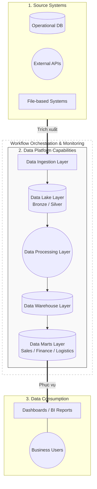

# Kiến trúc Tổng quan (High-Level Architecture)

## 1. Mục tiêu
Tài liệu này cung cấp bức tranh toàn cảnh về các năng lực (Capabilities) của Nền tảng Dữ liệu FastOrder. Sơ đồ không đi sâu vào chi tiết công nghệ (Physical) hay luồng xử lý cụ thể (Pipeline), mà tập trung trả lời 3 câu hỏi cốt lõi:
1. Dữ liệu đến từ đâu?
2. Nền tảng có những phân lớp chức năng nào để xử lý dữ liệu đó?
3. Ai là người khai thác giá trị cuối cùng?

---

## 2. Sơ đồ Kiến trúc (Enterprise Overview)

Sơ đồ dưới đây mô tả kiến trúc theo hướng phân lớp (Layered Architecture). Toàn bộ hệ thống được đặt dưới sự kiểm soát của một lớp Điều phối & Giám sát chung.

## 3. Vai trò của các Phân lớp (Layer Capabilities)
Thay vì nhìn Data Platform như một chiếc hộp đen, hệ thống được bóc tách thành các lớp với một trách nhiệm duy nhất (Single Responsibility):

### 3.1. Nhóm Nguồn & Tiêu thụ
Source Systems: Nơi sinh ra dữ liệu (Cơ sở dữ liệu bán hàng, API thời tiết/tỷ giá, File log hành vi).

Data Consumption: Nơi khai thác dữ liệu. Các phòng ban (Sales, Logistics, Finance) sử dụng BI Dashboard để đưa ra quyết định dựa trên dữ liệu đã được tinh chế.

### 3.2. Các phân lớp bên trong Data Platform
Data Ingestion Layer: Chịu trách nhiệm kết nối và hút dữ liệu từ bên ngoài vào hệ thống một cách an toàn mà không làm ảnh hưởng đến nguồn.

Data Lake Layer: Nơi lưu trữ vĩnh viễn dữ liệu thô (Bronze) và dữ liệu đã làm sạch bước đầu (Silver). Đảm bảo không mất mát dữ liệu gốc và có thể chạy lại quá trình xử lý bất cứ lúc nào.

Data Processing Layer: "Động cơ" tính toán của hệ thống. Chịu trách nhiệm thực thi các logic chuyển đổi, kết hợp dữ liệu nặng nhọc nhất.

Data Warehouse Layer: Lưu trữ dữ liệu đã được cấu trúc hóa, chuẩn hóa thành các thực thể kinh doanh cốt lõi (Khách hàng, Sản phẩm, Đơn hàng).

Data Marts Layer: Dữ liệu từ Warehouse được chia nhỏ và đóng gói lại theo nhu cầu cụ thể của từng phòng ban (ví dụ: Sales Mart chứa các Fact/Dim chỉ phục vụ đội Sales) để tối ưu hiệu suất truy vấn.

### 3.3. Lớp Điều phối Trung tâm
Workflow Orchestration & Monitoring: Không nằm trên đường ống dẫn dữ liệu, mà đóng vai trò như "Nhạc trưởng". Nó quyết định khi nào quá trình Ingestion bắt đầu, khi nào Processing chạy, và gửi cảnh báo nếu có luồng xử lý nào thất bại.