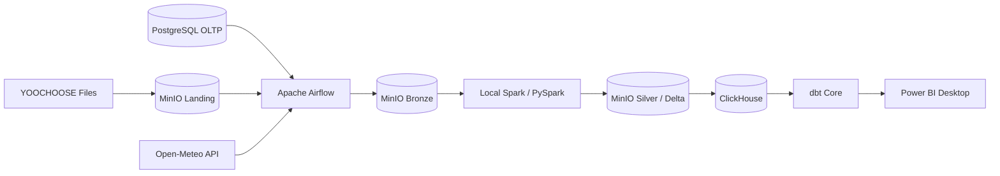

# Data Flow Diagram

## 1. Mục tiêu

Tài liệu này mô tả luồng dữ liệu E2E của FastOrder theo **kiến trúc local-first hiện tại/target**. Trạng thái triển khai chi tiết xem tại `../07-progress/02-current-status.md`.

---

## 2. End-to-End Flow



---

## 3. Flow theo source type

### 3.1. Operational PostgreSQL — ✅ Certified on MinIO

```text
PostgreSQL
  -> generic incremental extractor
  -> Pending Context
  -> PyArrow Parquet serialization
  -> MinIO Bronze
  -> Checkpoint commit
  -> Pending cleanup
```

Đặc điểm:

- cursor: `(updated_at, *primary_key_columns)`;
- deterministic extraction ID;
- replay-safe overwrite;
- checkpoint và pending độc lập theo bảng;
- E2E validation đã PASS 11/11 operational tables.

### 3.2. YOOCHOOSE File Flow — ⏳ MinIO migration pending

```text
External file source
  -> MinIO Landing
  -> File Discovery
  -> Manifest Manager
  -> deterministic Bronze Writer
  -> MinIO Bronze
```

State machine:

```text
NEW -> PENDING -> PROCESSED
       ^             |
       | retry       | rerun -> SKIP
       +-------------+
```

Landing và Bronze là hai boundary khác nhau: Landing là source delivery; Bronze là dữ liệu đã được FastOrder ingestion chấp nhận.

### 3.3. Open-Meteo Weather Flow — ⏳ MinIO migration pending

```text
Open-Meteo
  -> HTTP Client
  -> Technical Contract Validation
  -> Airflow
  -> Bronze ingestion unit
       response.json
       metadata.json
       _SUCCESS
```

Chỉ ingestion unit có `_SUCCESS` mới được xem là committed và đủ điều kiện lên Silver.

---

## 4. Bronze -> Silver

Target runtime:

```text
Committed Bronze
   -> Local Spark
   -> Transformation
   -> Silver Candidate
   -> Data Quality
   -> Validation
   -> Delta Silver
```

Weather Forecast Silver grain:

```text
warehouse_id + ingestion_id + forecast_time
```

Weather Historical Silver grain:

```text
warehouse_id + weather_time
```

Historical processing state dùng control dataset riêng để không trộn business grain với processing state.

---

## 5. Silver -> Analytics

```text
Silver
  -> ClickHouse staging/core
  -> dbt Core
  -> Fact / Dimension / Business Marts
  -> Power BI Desktop
```

ClickHouse/dbt/Power BI là target tiếp theo, chưa được mô tả như đã triển khai.

---

## 6. Commit và Replay Semantics

Mỗi source có commit protocol riêng nhưng cùng tuân theo nguyên tắc:

1. Ghi technical state trước điểm I/O rủi ro khi cần recovery.
2. Dùng deterministic identity cho cùng logical ingestion unit.
3. Chỉ advance processing state sau khi data write đã thành công.
4. Rerun không được tạo logical duplicate ngoài ý muốn.
5. Pipeline hoàn tất phải được kiểm bằng data reconciliation, không chỉ bằng Airflow task state.
