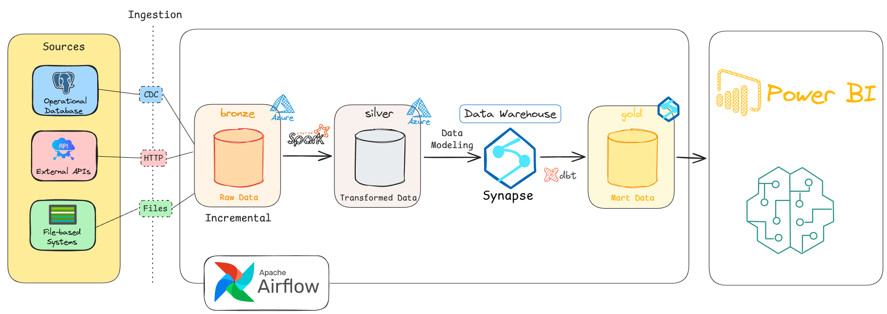

# Data Flow Diagram

This diagram illustrates the end-to-end data flow of the Enterprise E-Commerce Data Platform, from data ingestion to analytics and machine learning.

  

## Description

The data pipeline consists of the following stages:

1. **Data Sources**
   - Operational Databases
   - External APIs
   - File-based Systems

2. **Data Ingestion**
   - CDC for database changes
   - HTTP for API ingestion
   - File ingestion for batch data

3. **Bronze Layer**
   - Stores raw data incrementally in Azure Data Lake Storage.

4. **Silver Layer**
   - Apache Spark transforms and cleans raw data into structured datasets.

5. **Data Warehouse**
   - Azure Synapse Analytics stores modeled enterprise data.
   - dbt is used for data modeling and transformation.

6. **Gold Layer**
   - Business-ready data marts optimized for reporting and analytics.

7. **Consumption**
   - Power BI dashboards
   - Machine Learning applications
